# [CoRE Stack](https://core-stack.org/)

## About us

CoRE Stack: Commoning for Resilience and Equality is a social-tech enterprise dedicated to empowering underserved communities in low-resource and remote areas. Through our innovative participatory tech platforms, we foster community awareness of various pathways for resilience and development, promoting scientific decision-making and improved solidarity. We focus on strengthening community institutions to ensure equity and alignment along these pathways. Our commitment includes responsible AI practices, ethical considerations, and the use of open-source tools for transparent and accountable development. By enhancing understanding within communities and enabling them to manage natural resources, we contribute to a more sustainable, climate-resilient future with a focus on fairness, inclusivity, and environmental sustainability.

## Partners

Our esteemed partners on this journey include renowned institutions like IIT Delhi, IIT Palakkad, Gram Vaani, and Magasool. Strengthening our mission and shared goals  with consistent support and collaborative affiliations with GIZ, RainMatter, FES, Common Grounds, and Tarides.

## CoRE Stack Architecture

```mermaid
graph TB
    %% Data Sources
    NASA[🛰️ NASA Data Sources<br/>MODIS, Landsat, VIIRS<br/>REST API, JSON, GeoTIFF]
    
    %% Core Processing
    GEE[⚙️ Google Earth Engine<br/>Petabyte-scale Computation<br/>JavaScript, Python APIs<br/>Cloud-native Processing]
    
    %% Quality Assurance
    QA[✓ Quality Assurance Layer<br/>ML Validation Models<br/>Statistical Analysis<br/>Human Moderation Queue]
    
    %% Data Storage & Services
    PostGIS[(🗄️ PostGIS Database<br/>Spatial Data Store<br/>Temporal Indexing<br/>ACID Compliance)]
    
    GeoServer[🌍 GeoServer<br/>OGC Standards: WMS/WFS/WCS<br/>REST API Gateway<br/>Spatial Data Federation]
    
    %% Applications
    WebApp[💻 Web Application<br/>React + TypeScript<br/>WebGL Rendering<br/>Real-time Collaboration]
    
    MobileApp[📱 Mobile App<br/>React Native<br/>Android: Dart<br/>Offline-first Architecture]
    
    %% Community & Planning
    Community[👥 Community Platform<br/>Participatory Mapping<br/>Consensus Protocols<br/>Stakeholder Management]
    
    DPR[🤖 Automated DPR Generator<br/>ML-driven Impact Assessment<br/>Resource Optimization<br/>Regulatory Compliance]

    %% Data Flow Connections
    NASA -->|Scheduled ETL<br/>Batch Processing| GEE
    GEE -->|Processed Datasets<br/>Quality Metrics| QA
    QA -->|Validated Data<br/>Metadata Enrichment| PostGIS
    PostGIS <-->|Spatial Queries<br/>Transaction Log| GeoServer
    
    %% Application Connections
    GeoServer -->|REST API<br/>JSON/GeoJSON| WebApp
    GeoServer -->|Mobile API<br/>Compressed Tiles| MobileApp
    
    %% Bidirectional Data Flow
    WebApp <-->|User Contributions<br/>Real-time Updates| PostGIS
    MobileApp -->|Field Data Collection<br/>Crowdsourced Intelligence| PostGIS
    
    %% Community Integration
    WebApp -->|Visualization Layer<br/>Interactive Maps| Community
    Community -->|Planning Workflows<br/>Decision Records| DPR
    PostGIS -->|Historical Data<br/>Trend Analysis| DPR

    %% System Objectives (as subgraphs)
    subgraph "🔍 Ecosystem Intelligence"
        NASA
        GEE
        QA
    end
    
    subgraph "🛠️ Scientific Tooling"
        PostGIS
        GeoServer
        WebApp
    end
    
    subgraph "🤝 Participatory Governance"
        MobileApp
        Community
    end
    
    subgraph "🤖 Automated Impact Assessment"
        DPR
    end

    %% Styling
    classDef dataSource fill:#FF6B6B,stroke:#333,stroke-width:2px,color:#fff
    classDef processing fill:#4ECDC4,stroke:#333,stroke-width:2px,color:#fff
    classDef storage fill:#45B7D1,stroke:#333,stroke-width:2px,color:#fff
    classDef application fill:#96C93D,stroke:#333,stroke-width:2px,color:#fff
    classDef community fill:#FDA085,stroke:#333,stroke-width:2px,color:#fff
    classDef intelligence fill:#A8EDEA,stroke:#333,stroke-width:2px,color:#333

    class NASA dataSource
    class GEE,QA processing
    class PostGIS,GeoServer storage
    class WebApp,MobileApp application
    class Community community
    class DPR intelligence
```

Want to contribute? Head over to our <a href="https://github.com/core-stack-org/core-stack-backend/">backend repository</a> to explore the codebase, review open issues, and submit pull requests.

